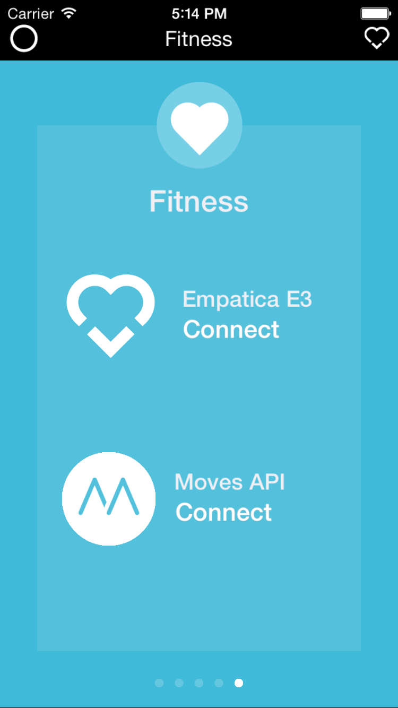
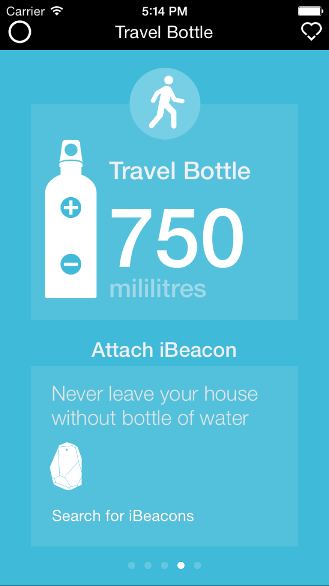
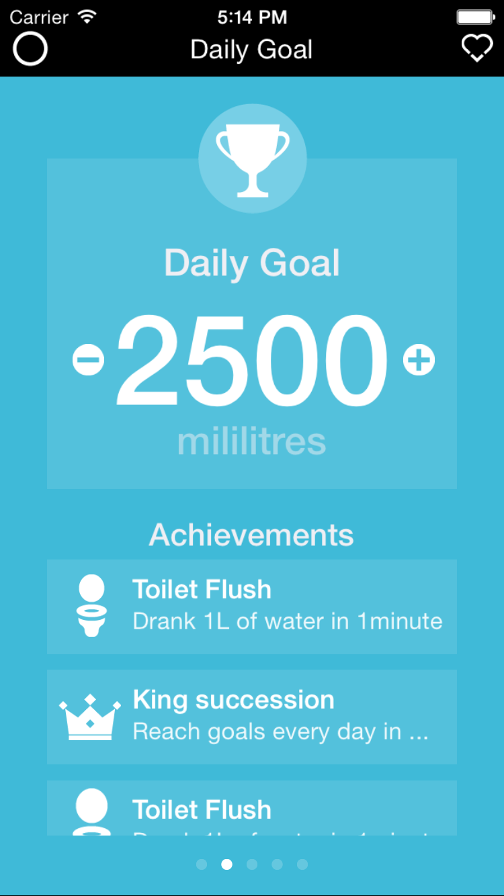

Hydrate Me
==========

iOS application monitoring hydratation levels with Empatica E3 wristband https://www.empatica.com/product-e4 .
The wristband measures (apart from other data) skin conductivity. It is to some extent possible to extrapolate 
current hydratation from this, which would be a great help for people over 50 - with age you lose sense to your 
hydratation levels which can be fatal on sunny day. 

In the end too many factors turned out to be affecting the readings, so medical use
was unatainable. Therefore the project was enhanced with water intake tracking and function that used Estimote 
Beacon attached to your water bottle to alert you if you forgot to bring your watter with you. http://estimote.com/

Hydrate me was a project that won 3rd place on Empatica Hackmed in Milano https://www.empatica.com/hackmed/ .
Thanks to Riccardo Arciulo and Olga Pustovalova for science & data help and wonderful guys from Empatica 
https://www.empatica.com/ for fun weekend :) 

Additional Info
---------------

Project was done with Objective-C and optimized for iOS 8. To use the Empatica API you
need to obtain Estimote SDK key. https://www.empatica.com/connect/login.php

